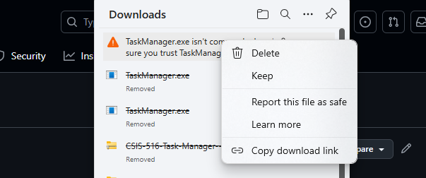
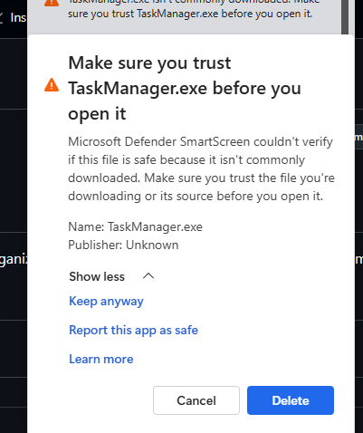

# CSIS516 TaskManager Application

## Description and Value
The **CSIS516 TaskManager** is a task management application developed using **Tkinter** and its associated libraries.  
It provides an efficient way for users to manage their to-do lists, serving as an online, on-the-go method for handling daily tasks.  
The application leverages technology to make task management as easy and convenient as possible for users. AI adds more value to it than
Other Task Manager Apps, since it's built right in for ease of use.

## Purpose
Users can:  
- View, create, and edit tasks  
- Set due dates  
- Organize tasks as they see fit 
- Get an AI recommendation for what tasks they should complete next

## Technologies Used
The application utilizes **Tkinter** for the graphical user interface and a **SQL database** to store user and task-related information. 
A **Chat GPT** AI model gives recommendations and suggestions about the user's tasks. These AI models run in the background
by using different **Threads** to ensure the user can use the app while the API runs.  

### Libraries Used:
- **Tkinter** – Handles the graphical user interface (GUI)  
- **Datetime** – Manages and stores date-related data  
- **Pillow** – Loads and processes images for Tkinter  
- **TKcalendar** - Gives a calendar control for Tkinter
- **OpenAI** - Communicates with Open AI's models to give AI responses to users
- **Threading** - Used to run processes in the background while users can use the rest of the app

## Setup
1. Under Releases, hit tags
2. Go to App
3. Download TaskManager.exe
4. Right-click the file, then click keep

5. Click Show More, then click Keep anyways

6. Now the app is ready to use (:

## YouTube
Follow this link to see how the application is used
https://youtu.be/UYHt0nz5NwM